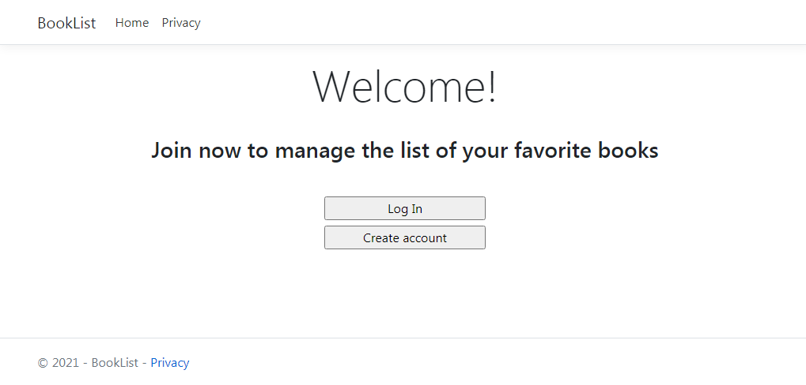
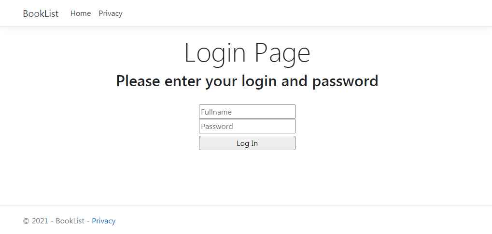
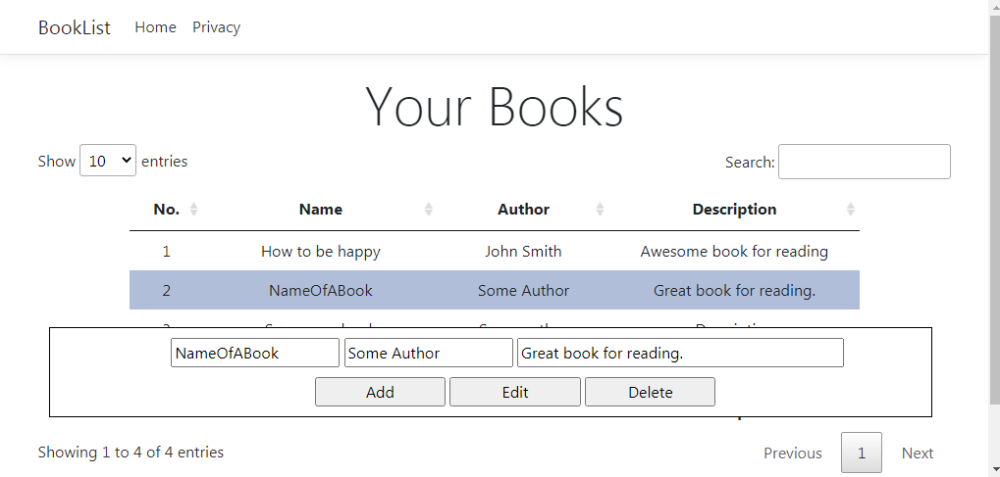

# BookList 

Application **BookList** is designed for creating and managing a table of *favorite books*. 
The app also incudes a simple *authentication system* for users. 





On the *Books page* you can manage the list of your favorite books: 



This app is written in `C#` using **ASP.NET Core** and **Razor Pages**. 

## How to use

### Prerequisites

- .NET Core 3.1;
- Any text editor (*VS Code*, *Sublime Text*, *Notepad++* etc) or *Visual Studio*;
- Command line or terminal (if you do not use *Visual Studio*).

### Dependencies 

- `Microsoft.Data.Sqlite` for SQLite Database;
- `xUnit` and `NUnit` for unit testing; 
- `Microsoft.Extensions.Logging` for logging; 
- `Microsoft.AspNetCore.Authentication.Cookies` for using cookies in authentication. 

### Launching this app 

In order to run this application, you need to type the following command into Windows command line: 
```
run.cmd
```

## Software Architecture 

This app consists of several projects such as: 
- **BookList**: consists of *Pages* (aka *Views*) and *ViewModels*; 
- **BookList.Models**: contains `Books` and `User` classes that are used for *Repository pattern* implementation; 
- **BookList.Services**: classes for *Repository pattern* implementation and interacting with *SQLite* database; 
- **Security**: classes for *hashing* and *substitution cipher*. 

[Here](Docs/About.md) you can find some more information about the *structure of this app*. 

<!--
## Code snippets 

### BookList 

### BookList.Models 

### BookList.Services 

`UserRepository` class: 
-->
